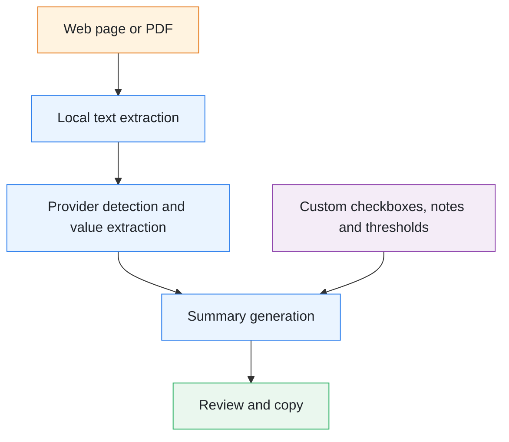

<p align="right">
  🇫🇷 <a href="./README.md">Français</a> |
  🇬🇧 <strong>English</strong>
</p>

# FlashCPAP

**FlashCPAP is an open-source browser extension that extracts data from CPAP/PAP telemonitoring reports displayed on a web page or stored in a PDF file, then generates a structured, editable clinical summary ready to be copied into the medical record.**

<p align="center">
  
  
  
  <a href="LICENSE">
    
  </a>
</p>

<p align="center">
  <a href="https://www.flashcpap.com">Official website</a> •
  <a href="https://www.flashcpap.com/docs">Documentation</a> •
  <a href="https://addons.mozilla.org/en-US/firefox/addon/flashcpap/">Firefox</a> •
  <a href="https://chromewebstore.google.com/detail/pedibchhakipflddbcfckhgojjagoiim">Chrome</a> •
  <a href="https://microsoftedge.microsoft.com/addons/detail/flashcpap/poakfgkhfiamihmcbihhajkjbdndgilf">Edge</a> •
  <a href="https://ko-fi.com/H2H81VJXO5">Support the project</a>
</p>

---

## ⚡ What is FlashCPAP for?

CPAP/PAP telemonitoring reports are presented differently across providers, portals and software platforms.

Reviewing them often requires clinicians to manually locate and copy:

- adherence or average usage time;
- residual AHI;
- leak data;
- ventilation mode;
- fixed or automatic pressure settings;
- IPAP and EPAP;
- other report-specific values.

FlashCPAP automates this repetitive collection process and turns detected values into a standardized, editable summary that can be verified before being copied into the patient record.

> [!IMPORTANT]
> FlashCPAP is a documentation and workflow support tool.
>
> It does not provide diagnoses, treatment recommendations or autonomous medical decisions. All extracted data must be reviewed by a healthcare professional.

---

## 🔄 How it works



Each provider can have its own configuration:

- portal domains or URLs;
- PDF detection keywords;
- labels associated with each value;
- expected value types and units;
- exclusion or priority rules;
- display order in the generated summary.

---

## Example output

```text
Telemonitoring data:
Provider: Example

Mode: Auto-CPAP
Minimum pressure: 6 cmH2O
Maximum pressure: 14 cmH2O
Average adherence: 6.4 h
Residual AHI: 2.1/h
Leaks: 8 L/min

The device is well tolerated.
The patient reports clinical benefit.
No residual daytime sleepiness.
```

This example is illustrative. Fields, wording, units and display order are customizable.

---

## 🧩 Main features

### Web page and PDF analysis

FlashCPAP can analyze:

- text displayed in a provider web portal;
- text contained in different page frames;
- a PDF file selected directly in the extension.

When a PDF is loaded, it is analyzed instead of the active web page.

> [!NOTE]
> The PDF must contain an extractable text layer. FlashCPAP does not currently perform optical character recognition on image-only scanned documents.

### Custom providers and fields

Users can:

- create or import a provider profile;
- associate one or more domains with a provider;
- configure keywords used to detect provider reports;
- add, edit and reorder extracted fields;
- customize labels and units;
- import or export configurations as JSON.

Fields can contain text, numeric values, time values or groups of related values.

### Source verification

Detected values are highlighted in the extracted source text.

Navigation tools make it possible to locate each value and confirm that the extracted result matches the original report.

### Editable clinical summary

The generated summary can be:

- edited manually;
- displayed as a readable preview;
- enriched with free text;
- reorganized;
- copied to the clipboard.

Manual additions are preserved whenever possible when the summary is regenerated.

### Custom checkboxes and linked phrases

Checkboxes can quickly add recurring clinical statements, for example:

- good or poor tolerance;
- reported clinical benefit;
- persistent or improved daytime sleepiness;
- mask-related problems;
- dryness;
- sleep schedule information;
- any other user-defined observation.

Checkboxes can be grouped into families, marked as favorites and combined to generate more natural sentences.

### Custom thresholds

Users can define their own thresholds for selected values such as:

- adherence;
- residual AHI;
- leak data.

Example:

```text
Average adherence: 6.4 h (good adherence)
Residual AHI: 2.1/h (effective treatment)
Leaks: 8 L/min (no significant leaks)
```

A custom statement can be associated with each side of a threshold.

This feature only applies rules defined by the user. It does not constitute autonomous medical interpretation.

---

## Use cases

FlashCPAP can help with:

- preparing CPAP/PAP follow-up consultations;
- reducing the time spent writing clinical notes;
- limiting transcription errors;
- standardizing documentation;
- harmonizing data from multiple providers;
- reviewing several reports opened in different browser tabs.

---

## FlashCPAP does not use AI

FlashCPAP currently uses:

- no generative artificial intelligence;
- no large language model;
- no remote analysis service;
- no medical interpretation API.

Extraction is based on explicit, configurable rules. Users can therefore verify exactly where each value was found.

---

## For developers

This repository can serve as a foundation for projects that need:

- text extraction from a provider web portal;
- PDF report parsing with PDF.js;
- automatic source or provider detection;
- rule-based and keyword-based CPAP/PAP report parsing;
- extraction of adherence, AHI, pressure or leak data;
- highlighting of recognized values in the source text;
- generation of a structured, editable summary;
- compatibility with Firefox, Chrome and Edge.

Related terms:

```text
CPAP report parser
PAP compliance report extraction
CPAP adherence data extraction
CPAP telemonitoring
PPC télésuivi
residual AHI extraction
CPAP leak data
sleep medicine browser extension
clinical note generator
medical report parser
PDF report extraction
local-first medical software
rule-based document parsing
```

---

## Installation

### Official extension stores

- [Firefox Add-ons](https://addons.mozilla.org/en-US/firefox/addon/flashcpap/)
- [Chrome Web Store](https://chromewebstore.google.com/detail/pedibchhakipflddbcfckhgojjagoiim)
- [Microsoft Edge Add-ons](https://microsoftedge.microsoft.com/addons/detail/flashcpap/poakfgkhfiamihmcbihhajkjbdndgilf)

### Local installation

Requirements: `bash`, `python3` and `zip`.

On Windows, use **Git Bash** or **WSL**.

```bash
bash build.sh firefox
bash build.sh chromium
bash build.sh edge
```

Generated packages are stored in the `dist/` directory.

For Chrome or Edge:

1. open the browser extension management page;
2. enable **Developer mode**;
3. select **Load unpacked**;
4. choose the extension directory.

---

## Quick start

### Initial configuration

1. Install and open FlashCPAP.
2. Create or import a provider profile.
3. Associate the provider portal domain.
4. Add the fields to extract.
5. Define the corresponding labels or keywords.

### Daily use

1. Open a CPAP/PAP report or select a PDF file.
2. Open FlashCPAP.
3. Click **Analyze page**.
4. Review the highlighted values.
5. Add the relevant observations.
6. Edit and copy the summary.

Detailed documentation is available at [flashcpap.com/docs](https://www.flashcpap.com/docs).

---

## 🔒 Privacy

FlashCPAP follows a **local-first** approach:

- web pages and PDFs are processed locally in the browser;
- report content is not sent to a remote analysis server;
- settings are stored locally;
- JSON imports and exports are initiated by the user;
- no data is used to train an artificial intelligence model.

---

## Browser permissions

| Permission | Purpose |
|---|---|
| `activeTab`, `tabs`, and `webNavigation` | Identify the source tab and allowed frames |
| `scripting` | Read text displayed on the web page |
| `storage` | Save local configurations |
| `clipboardWrite` | Copy the generated summary |
| Optional host permission | Allow analysis on a user-approved domain |

Website access permissions are requested only when required.

---

## ⚠️ Limitations

- A provider-specific configuration is required.
- Changes to a provider portal may require rule updates.
- PDF extraction quality depends on the document text layer.
- Scanned documents without extractable text are not supported.
- Extracted values must always be reviewed.
- FlashCPAP does not replace clinical judgment.
- FlashCPAP does not recommend CPAP/PAP settings or treatment changes.

**The healthcare professional remains responsible for validating the final summary.**

---

## Technical architecture

```text
background.js              Background logic
popup.html                 Main user interface
src/extraction.js          Web and PDF text extraction
src/parsing.js             Value parsing
src/analysis-runner.js     Analysis workflow
src/summary.js             Summary generation
src/field-management.js    Provider field configuration
src/platform/              Browser compatibility adapters
lib/                       Local dependencies, including PDF.js
build.sh                   Firefox, Chrome and Edge builds
```

Main technologies:

- modular JavaScript;
- Manifest V3;
- WebExtensions API;
- PDF.js;
- HTML and CSS;
- no remote analysis service.

---

## Contributing

Contributions are welcome to improve parsing, the interface, tests, documentation and cross-browser compatibility.

Bug reports and examples must not contain any patient-identifying information.

---

## License

FlashCPAP is distributed under the [Apache License 2.0](LICENSE).

---

## Contact

- Official website: [flashcpap.com](https://www.flashcpap.com)
- Documentation: [flashcpap.com/docs](https://www.flashcpap.com/docs)
- GitHub repository: [molipoli-blip/flashcpap](https://github.com/molipoli-blip/flashcpap)
- Support the project: [Ko-fi](https://ko-fi.com/H2H81VJXO5)
