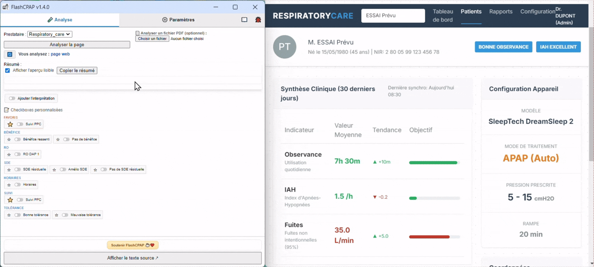
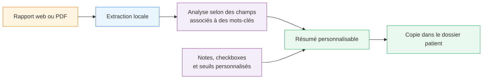

<!-- markdownlint-disable MD013 MD033 MD041 -->

<p align="right">
  🇫🇷 <strong>Français</strong> ·
  🇬🇧 <a href="./README.en.md">English</a>
</p>

<p align="center">
  
</p>

<h1 align="center">FlashCPAP</h1>

<p align="center">
  <strong>Des rapports PPC à un résumé clinique structuré, vérifiable et prêt à copier.</strong>
</p>

<p align="center">
  Extension de navigateur open source pour extraire localement les données de télésuivi
  depuis une page web ou un PDF.
</p>

<p align="center">
  
  
  
  <a href="./notes/LICENSE">
    
  </a>
</p>

<p align="center">
  <a href="https://www.flashcpap.com">Site officiel</a> ·
  <a href="https://www.flashcpap.com/docs">Documentation</a> ·
  <a href="https://addons.mozilla.org/en-US/firefox/addon/flashcpap/">Firefox</a> ·
  <a href="https://chromewebstore.google.com/detail/pedibchhakipflddbcfckhgojjagoiim">Chrome</a> ·
  <a href="https://microsoftedge.microsoft.com/addons/detail/flashcpap/poakfgkhfiamihmcbihhajkjbdndgilf">Edge</a> ·
  <a href="https://ko-fi.com/H2H81VJXO5">Soutenir le projet</a>
</p>

---

## Démonstration

<p align="center">
  
</p>

<p align="center">
  <sub>Analyse du rapport, contrôle des valeurs détectées, personnalisation puis copie du résumé.</sub>
</p>

> [!IMPORTANT]
> FlashCPAP est un outil d’aide à la saisie et à la standardisation des comptes rendus.
> Il ne pose pas de diagnostic, ne recommande aucun traitement et ne remplace pas la
> vérification des données par un professionnel de santé.

## En un coup d’œil

| Source | Traitement | Résultat |
| --- | --- | --- |
| Page web ou PDF avec couche de texte | Extraction locale par règles et mots-clés configurables | Résumé clinique modifiable et prêt à copier |



FlashCPAP automatise la recherche des données couramment présentes dans les rapports
de télésuivi PPC : observance, durée moyenne d’utilisation, IAH résiduel, fuites,
mode de ventilation, pressions fixes ou automatiques, IPAP, EPAP et autres champs
propres à chaque rapport.

Les valeurs reconnues restent visibles et vérifiables dans le texte source avant
d’être intégrées au dossier patient.

## Fonctionnalités

### Extraire les données d’une page web ou d’un PDF

- Analyse le texte affiché dans un portail web et ses sous-frames.
- Lit un fichier PDF sélectionné dans l’extension avec PDF.js.
- Détecte le prestataire à partir du domaine ou de mots-clés du rapport.
- Extrait des champs textuels, numériques, des durées ou des groupes de valeurs.

Lorsqu’un PDF est chargé, il est analysé à la place de la page web.

> [!NOTE]
> Le PDF doit contenir une couche de texte exploitable. FlashCPAP ne réalise pas
> actuellement de reconnaissance optique de caractères (OCR) sur les documents
> constitués uniquement d’images.

### Configurer chaque prestataire

- Créer ou importer un profil de prestataire.
- Associer un ou plusieurs domaines au profil.
- Définir les champs avec des mots clés pour extraire les données recherchées.
- Ajouter, modifier et réorganiser les champs à extraire.
- Personnaliser les intitulés, les unités et l’ordre du résumé.
- Ajuster les règles d’exclusion, de priorité et les types de valeurs attendus.
- Possibilité d'importer ou exporter la configuration d'un prestataire au format JSON.

### Contrôler les valeurs extraites

Les éléments reconnus sont surlignés dans le texte source. Une navigation dédiée
permet de retrouver chaque donnée et de confirmer qu’elle correspond au rapport
original. 

### Composer un résumé clinique

- Modifier manuellement le texte généré.
- Ajouter des notes libres.
- Réorganiser les informations.
- Prévisualiser le résultat.
- Copier le résumé dans le presse-papiers.

### Ajouter des phrases récurrentes

Des checkboxes personnalisables permettent d’insérer rapidement des phrases répétitives et récurrentes entre
plusieurs consultations.
Des checkboxes par défaut portent sur la tolérance, le bénéfice clinique, la somnolence, le masque, la sécheresse,
les horaires de sommeil ou toute autre observation utile.

Elles peuvent être regroupées par famille, placées en favoris et combinées pour une mise en page 
par puces ou tout sur une même la ligne.

### Appliquer des seuils personnalisés

L’utilisateur peut définir ses propres seuils et formulations pour certaines valeurs,
par exemple l’observance, l’IAH résiduel ou les fuites :

```text
Observance moyenne : 6,4 h (bonne observance)
IAH résiduel : 2,1/h (traitement efficace)
Fuites : 8 L/min (absence de fuites importantes)
```

Cette fonction applique uniquement les règles définies par l’utilisateur. Elle ne
constitue pas une interprétation médicale autonome.

## Compatibilité

### Sources et plateformes de télésuivi

FlashCPAP fonctionne avec :

- les pages web auxquelles l’utilisateur autorise explicitement l’accès ;
- les rapports PDF contenant une couche de texte exploitable ;

Une évolution d’un portail ou de son format de rapport peut toutefois nécessiter une mise à jour
du profil prestataire associé.

## Exemple de résultat

```text
Données de télésuivi :
Prestataire : Exemple

Mode : Auto-CPAP
Pression minimale : 6 cmH2O
Pression maximale : 14 cmH2O
Observance moyenne : 6,4 h
IAH résiduel : 2,1/h
Fuites : 8 L/min

Le dispositif est bien toléré.
Le patient ressent un bénéfice clinique.
Absence de somnolence résiduelle.
```

Cet exemple est illustratif. Les champs, les formulations, les unités, les phrases 
et leur ordre sont personnalisables.

## Installation

### Depuis une boutique officielle

- [Installer pour Firefox](https://addons.mozilla.org/en-US/firefox/addon/flashcpap/)
- [Installer pour Chrome](https://chromewebstore.google.com/detail/pedibchhakipflddbcfckhgojjagoiim)
- [Installer pour Edge](https://microsoftedge.microsoft.com/addons/detail/flashcpap/poakfgkhfiamihmcbihhajkjbdndgilf)

## Utilisation

### Première configuration

1. Installer puis ouvrir FlashCPAP.
2. Créer ou importer un profil de prestataire.
3. Associer le domaine du portail.
4. Ajouter les champs à extraire.
5. Définir les libellés ou mots-clés correspondants.

### Au quotidien

1. Ouvrir un rapport PPC ou sélectionner un PDF.
2. Ouvrir FlashCPAP.
3. Cliquer sur **Analyser la page**.
4. Contrôler les valeurs surlignées dans la source.
5. Ajouter les observations utiles.
6. Relire, modifier puis copier le résumé.

La documentation détaillée est disponible sur
[flashcpap.com/docs](https://www.flashcpap.com/docs).

## Cas d’usage

FlashCPAP peut aider à :

- préparer une consultation de suivi de PPC ;
- accélérer la rédaction d’un compte rendu ;
- limiter les erreurs de recopie ;
- standardiser les notes cliniques ;
- analyser successivement plusieurs rapports ouverts dans différents onglets.

## Confidentialité

FlashCPAP suit une approche **local-first** :

- les pages et les PDF sont traités localement dans le navigateur ;
- le contenu des rapports n’est pas envoyé à un serveur d’analyse ;
- les paramètres sont enregistrés localement ;
- les imports et exports JSON sont déclenchés par l’utilisateur ;
- aucune donnée n’est utilisée pour entraîner un modèle d’intelligence artificielle.

FlashCPAP n’utilise ni IA générative, ni modèle de langage, ni service d’analyse
distant, ni API d’interprétation médicale. 

### Autorisations utilisées

| Autorisation | Utilisation |
| --- | --- |
| `activeTab` et `tabs` | Identifier et suivre l’onglet source |
| `scripting` | Lire le texte affiché dans la page |
| `storage` | Enregistrer les configurations locales |
| `clipboardWrite` | Copier le résumé |
| Autorisation d’hôte optionnelle | Autoriser l’analyse sur un domaine choisi |

Les autorisations d’accès aux sites sont demandées uniquement lorsqu’elles deviennent
nécessaires.

## Limites et responsabilité

- Une modification d’un portail par le propriétaire peut nécessiter une adaptation des règles.
- FlashCPAP ne remplace pas le jugement clinique.
- FlashCPAP ne recommande aucun réglage de PPC ni aucun traitement.

> [!WARNING]
> La validation finale du résumé reste sous la responsabilité du professionnel
> de santé.

## Pour les développeurs

### Installation depuis le code source

Prérequis : `bash`, `python3` et `zip`. Sous Windows, utiliser **Git Bash** ou
**WSL**.

```bash
bash build.sh firefox
bash build.sh chromium
bash build.sh edge
```

Les archives sont générées dans le dossier `dist/`.


### Architecture

```text
background.js              Logique d’arrière-plan
popup.html                 Interface principale
src/extraction.js          Extraction web et PDF
src/parsing.js             Parsing des valeurs
src/analysis-runner.js     Workflow d’analyse
src/summary.js             Génération du résumé
src/field-management.js    Configuration des champs
src/platform/              Compatibilité navigateurs
lib/                       Dépendances locales, dont PDF.js
build.sh                   Builds Firefox, Chrome et Edge
```

Technologies principales :

- JavaScript modulaire ;
- Manifest V3 ;
- API WebExtensions ;
- PDF.js ;
- HTML et CSS ;
- aucun service d’analyse distant.

<details>
<summary>Termes techniques associés</summary>

```text
CPAP report parser
PAP compliance report extraction
CPAP adherence data extraction
CPAP telemonitoring
PPC télésuivi
residual AHI extraction
CPAP leak data
sleep medicine browser extension
clinical note generator
medical report parser
PDF report extraction
local-first medical software
rule-based document parsing
CPAP report
consultation de suivi PPC
obstructive sleep apnea
syndrome d'apnée obstructif du sommeil

```

</details>

## Contribution

Les contributions sont les bienvenues pour améliorer le parsing, l’interface, les
tests, la documentation et la compatibilité entre navigateurs.

> [!CAUTION]
> Aucune donnée permettant d’identifier un patient ne doit être incluse dans un
> rapport de bug ou un exemple partagé.

## Licence

FlashCPAP est distribué sous [licence Apache 2.0](./notes/LICENSE).

## Contact

- Site officiel : [flashcpap.com](https://www.flashcpap.com)
- Documentation : [flashcpap.com/docs](https://www.flashcpap.com/docs)
- Dépôt GitHub : [molipoli-blip/flashcpap](https://github.com/molipoli-blip/flashcpap)
- Soutien au projet : [Ko-fi](https://ko-fi.com/H2H81VJXO5)
