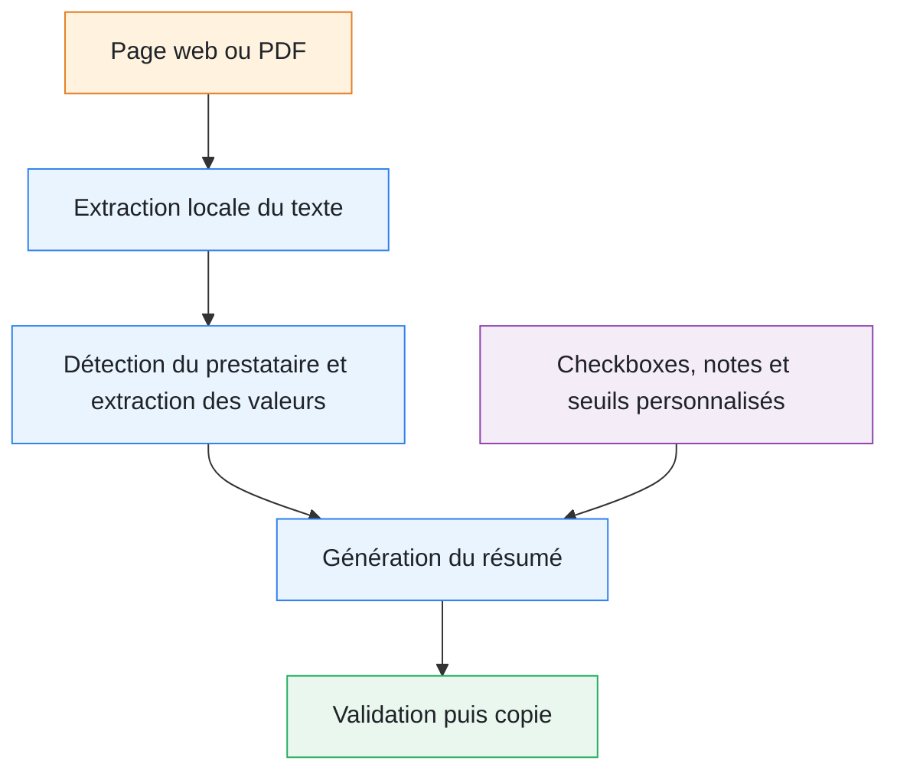

<p align="right">
  🇫🇷 <strong>Français</strong> |
  🇬🇧 <a href="./README.en.md">English</a>
</p>

# FlashCPAP

**FlashCPAP est une extension de navigateur open source qui extrait les données des rapports de télésuivi PPC/CPAP depuis une page web ou un fichier PDF, puis génère un résumé clinique structuré, modifiable et prêt à copier dans le dossier médical.**

<p align="center">
  
  
  
  <a href="LICENSE">
    
  </a>
</p>

<p align="center">
  <a href="https://www.flashcpap.com">Site officiel</a> •
  <a href="https://www.flashcpap.com/docs">Documentation</a> •
  <a href="https://addons.mozilla.org/en-US/firefox/addon/flashcpap/">Firefox</a> •
  <a href="https://chromewebstore.google.com/detail/pedibchhakipflddbcfckhgojjagoiim">Chrome</a> •
  <a href="https://microsoftedge.microsoft.com/addons/detail/flashcpap/poakfgkhfiamihmcbihhajkjbdndgilf">Edge</a> •
  <a href="https://ko-fi.com/H2H81VJXO5">Soutenir le projet</a>
</p>

---

## ⚡ À quoi sert FlashCPAP ?

Les rapports de télésuivi PPC sont présentés différemment selon les prestataires, les portails et les logiciels.

Leur analyse nécessite souvent de rechercher puis recopier manuellement :

- l’observance ou la durée moyenne d’utilisation ;
- l’IAH résiduel ;
- les fuites ;
- le mode de ventilation ;
- les pressions fixes ou automatiques ;
- l’IPAP et l’EPAP ;
- d’autres données propres à chaque rapport.

FlashCPAP automatise cette collecte et transforme les valeurs détectées en un résumé standardisé, modifiable et vérifiable avant sa copie dans le dossier patient.

> [!IMPORTANT]
> FlashCPAP est un outil d’aide à la saisie et à la standardisation des comptes rendus.
>
> Il ne pose pas de diagnostic, ne recommande aucun traitement et ne remplace pas la vérification des données par un professionnel de santé.

---

## 🔄 Fonctionnement



Chaque prestataire peut disposer de sa propre configuration :

- domaines ou URL du portail ;
- mots-clés de détection dans les PDF ;
- libellés associés aux données ;
- types de valeurs et unités attendues ;
- règles d’exclusion ou de priorité ;
- ordre d’affichage dans le résumé.

---

## Exemple de résultat

```text
Données de télésuivi :
Prestataire : Exemple

Mode : Auto-CPAP
Pression minimale : 6 cmH2O
Pression maximale : 14 cmH2O
Observance moyenne : 6,4 h
IAH résiduel : 2,1/h
Fuites : 8 L/min

Le dispositif est bien toléré.
Le patient ressent un bénéfice clinique.
Absence de somnolence résiduelle.
```

Cet exemple est illustratif. Les champs, les formulations, les unités et leur ordre sont personnalisables.

---

## 🧩 Fonctionnalités principales

### Analyse de pages web et de PDF

FlashCPAP peut analyser :

- le texte affiché dans un portail web ;
- les différentes sous-frames d’une page ;
- un fichier PDF sélectionné dans l’extension.

Lorsqu’un PDF est chargé, il est analysé à la place de la page web.

> [!NOTE]
> Le PDF doit contenir une couche de texte exploitable. FlashCPAP ne réalise pas actuellement de reconnaissance optique de caractères sur les documents constitués uniquement d’images.

### Prestataires et champs personnalisables

L’utilisateur peut :

- créer ou importer un profil de prestataire ;
- associer un domaine au prestataire ;
- configurer les mots-clés permettant de détecter ses rapports ;
- ajouter, modifier et réorganiser les champs à extraire ;
- personnaliser les intitulés et les unités ;
- importer ou exporter la configuration au format JSON.

Les champs peuvent contenir du texte, des valeurs numériques, des durées ou plusieurs valeurs associées.

### Vérification des valeurs extraites

Les éléments reconnus sont surlignés dans le texte source.

Une navigation permet de retrouver chaque donnée afin de vérifier que la valeur extraite correspond bien au rapport original.

### Résumé clinique modifiable

Le résumé généré peut être :

- modifié manuellement ;
- affiché sous forme d’aperçu lisible ;
- enrichi avec du texte libre ;
- réorganisé ;
- copié dans le presse-papiers.

Les modifications manuelles sont conservées autant que possible lorsque le résumé est régénéré.

### Checkboxes et phrases personnalisées

Des cases à cocher peuvent ajouter rapidement des formulations récurrentes, par exemple :

- bonne ou mauvaise tolérance ;
- bénéfice clinique ressenti ;
- persistance ou amélioration de la somnolence ;
- problèmes de masque ;
- sécheresse ;
- horaires de sommeil ;
- toute observation définie par l’utilisateur.

Les checkboxes peuvent être regroupées par famille, placées en favoris et combinées pour produire des phrases plus naturelles.

### Seuils personnalisés

L’utilisateur peut définir ses propres seuils pour certaines données comme :

- l’observance ;
- l’IAH résiduel ;
- les fuites.

Exemple :

```text
Observance moyenne : 6,4 h (bonne observance)
IAH résiduel : 2,1/h (traitement efficace)
Fuites : 8 L/min (absence de fuites importantes)
```

Une formulation personnalisée peut être associée à chaque côté du seuil.

Cette fonction applique uniquement les règles définies par l’utilisateur. Elle ne constitue pas une interprétation médicale autonome.

---

## Cas d’usage

FlashCPAP peut aider à :

- préparer une consultation de suivi de PPC ;
- accélérer la rédaction d’un compte rendu ;
- limiter les erreurs de recopie ;
- standardiser les notes cliniques ;
- harmoniser les données provenant de plusieurs prestataires ;
- analyser successivement plusieurs rapports ouverts dans différents onglets.

---

## FlashCPAP n’utilise pas d’IA

FlashCPAP n’utilise actuellement :

- ni intelligence artificielle générative ;
- ni modèle de langage ;
- ni service d’analyse distant ;
- ni API d’interprétation médicale.

L’extraction repose sur des règles explicites et configurables. L’utilisateur peut donc vérifier précisément où chaque valeur a été trouvée.

---

## Pour les développeurs

Ce dépôt peut servir de base pour des projets nécessitant :

- l’extraction du texte d’un portail web ;
- la lecture de rapports PDF avec PDF.js ;
- la détection automatique d’une source ;
- le parsing de rapports PPC/CPAP par règles et mots-clés ;
- l’extraction de données d’observance, d’IAH, de pression ou de fuites ;
- le surlignage des valeurs dans le texte source ;
- la génération d’un résumé structuré et modifiable ;
- une compatibilité Firefox, Chrome et Edge.

Termes associés :

```text
CPAP report parser
PAP compliance report extraction
CPAP adherence data extraction
CPAP telemonitoring
PPC télésuivi
residual AHI extraction
CPAP leak data
sleep medicine browser extension
clinical note generator
medical report parser
PDF report extraction
local-first medical software
rule-based document parsing
```

---

## Installation

### Boutiques officielles

- [Firefox Add-ons](https://addons.mozilla.org/en-US/firefox/addon/flashcpap/)
- [Chrome Web Store](https://chromewebstore.google.com/detail/pedibchhakipflddbcfckhgojjagoiim)
- [Microsoft Edge Add-ons](https://microsoftedge.microsoft.com/addons/detail/flashcpap/poakfgkhfiamihmcbihhajkjbdndgilf)

### Installation locale

Prérequis : `bash`, `python3` et `zip`.

Sous Windows, utiliser **Git Bash** ou **WSL**.

```bash
bash build.sh firefox
bash build.sh chromium
bash build.sh edge
```

Les archives sont générées dans le dossier `dist/`.

Pour Chrome ou Edge :

1. ouvrir la page de gestion des extensions ;
2. activer le mode développeur ;
3. cliquer sur **Charger l’extension non empaquetée** ;
4. sélectionner le dossier de l’extension.

---

## Démarrage rapide

### Première configuration

1. Installer et ouvrir FlashCPAP.
2. Créer ou importer un prestataire.
3. Associer le domaine du portail.
4. Ajouter les champs à extraire.
5. Définir les libellés ou mots-clés correspondants.

### Utilisation quotidienne

1. Ouvrir un rapport PPC ou sélectionner un PDF.
2. Ouvrir FlashCPAP.
3. Cliquer sur **Analyser la page**.
4. Contrôler les valeurs surlignées.
5. Ajouter les observations utiles.
6. Modifier puis copier le résumé.

La documentation détaillée est disponible sur [flashcpap.com/docs](https://www.flashcpap.com/docs).

---

## 🔒 Confidentialité

FlashCPAP suit une approche **local-first** :

- les pages et les PDF sont traités localement dans le navigateur ;
- le contenu des rapports n’est pas envoyé à un serveur d’analyse ;
- les paramètres sont enregistrés localement ;
- les imports et exports JSON sont déclenchés par l’utilisateur ;
- aucune donnée n’est utilisée pour entraîner un modèle d’intelligence artificielle.

---

## Autorisations utilisées

| Autorisation | Utilisation |
|---|---|
| `activeTab` et `tabs` | Identifier et suivre l’onglet source |
| `scripting` | Lire le texte affiché dans la page |
| `storage` | Enregistrer les configurations locales |
| `clipboardWrite` | Copier le résumé |
| Autorisation d’hôte optionnelle | Autoriser l’analyse sur un domaine choisi |

Les autorisations d’accès aux sites sont demandées uniquement lorsqu’elles deviennent nécessaires.

---

## ⚠️ Limites

- Une configuration adaptée au prestataire est nécessaire.
- Une modification d’un portail peut nécessiter une adaptation des règles.
- La qualité de l’analyse PDF dépend de la couche de texte.
- Les documents numérisés sans texte exploitable ne sont pas pris en charge.
- Les valeurs extraites doivent toujours être vérifiées.
- FlashCPAP ne remplace pas le jugement clinique.
- FlashCPAP ne recommande aucun réglage de PPC ni aucun traitement.

**La validation finale du résumé reste sous la responsabilité du professionnel de santé.**

---

## Architecture technique

```text
background.js              Logique d’arrière-plan
popup.html                 Interface principale
src/extraction.js          Extraction web et PDF
src/parsing.js             Parsing des valeurs
src/analysis-runner.js     Workflow d’analyse
src/summary.js             Génération du résumé
src/field-management.js    Configuration des champs
src/platform/              Compatibilité navigateurs
lib/                       Dépendances locales, dont PDF.js
build.sh                   Builds Firefox, Chrome et Edge
```

Technologies principales :

- JavaScript modulaire ;
- Manifest V3 ;
- API WebExtensions ;
- PDF.js ;
- HTML et CSS ;
- aucun service d’analyse distant.

---

## Contribution

Les contributions sont les bienvenues pour améliorer le parsing, l’interface, les tests, la documentation et la compatibilité entre navigateurs.

Aucune donnée permettant d’identifier un patient ne doit être incluse dans un rapport de bug ou un exemple partagé.

---

## Licence

FlashCPAP est distribué sous [licence Apache 2.0](LICENSE).

---

## Contact

- Site officiel : [flashcpap.com](https://www.flashcpap.com)
- Documentation : [flashcpap.com/docs](https://www.flashcpap.com/docs)
- Dépôt GitHub : [molipoli-blip/flashcpap](https://github.com/molipoli-blip/flashcpap)
- Soutien au projet : [Ko-fi](https://ko-fi.com/H2H81VJXO5)
